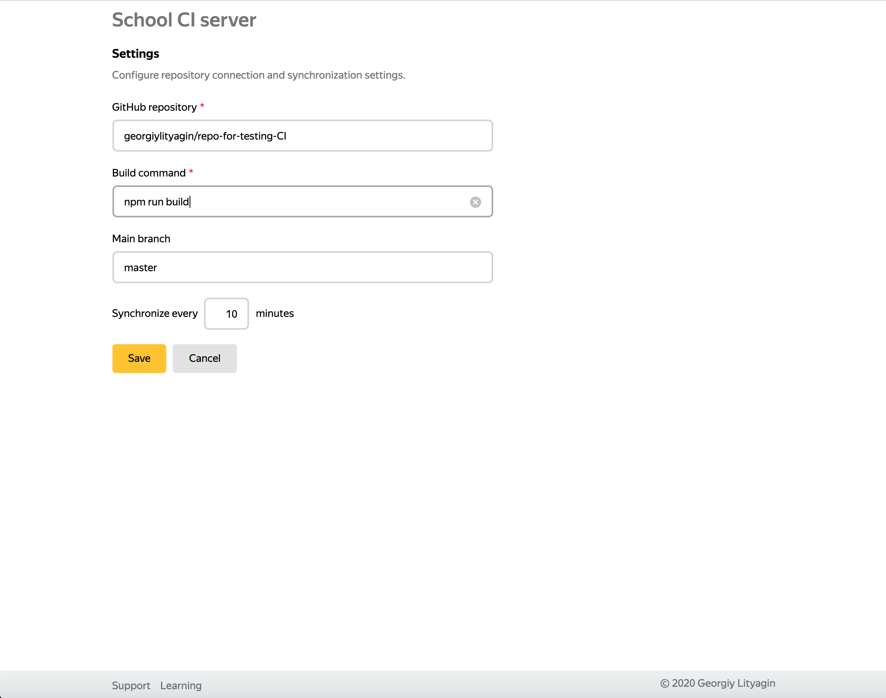
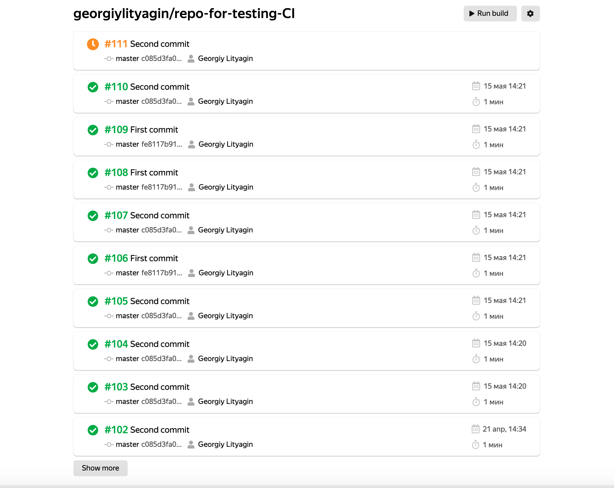
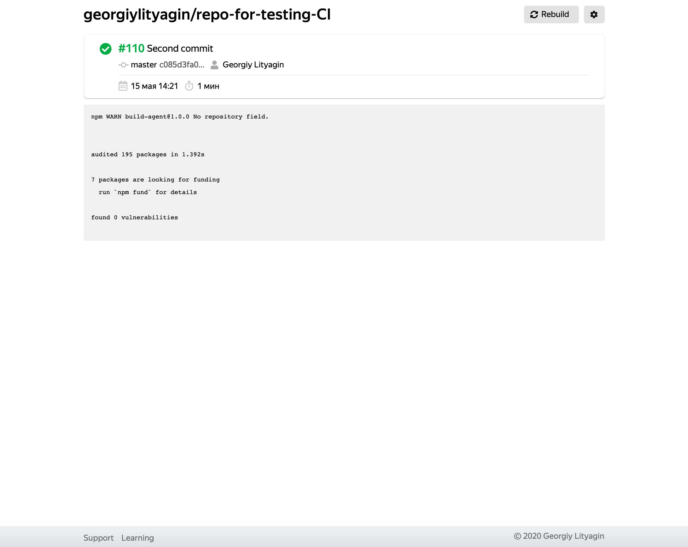

# CI Сервер

CI сервер, который работает с GitHub репозиторием. Параметры репозитория можно задать в настройках.

Для любого из коммитов репозитория можно запустить операцию сборки. Сервер также может сам проверять репозиторий на появление новых коммитов и добавлять их в очередь на сборку. Для этого надо задать период проверки в настройках.

Билд-сервер ходит за заданиями на сборку в базу данных и передает задание на сборку одному из агентов. Потом принимает результаты сборки и записывает их в БД.

Билд-агенты принимают задания на сборку и отсылают результаты на билд-сервер.

Скриншоты UI:

<details>
<summary>Настройки</summary>


</details>

<details>
<summary>Список сборок</summary>


</details>

<details>
<summary>Детали сборки</summary>


</details>


**Версия Node — 12.16.2**

## Установка и запуск CI-сервера и клиента

**Сервер:**

Перед запуском необходимо создать файл `.env` в папке `ci-server` и записать там свой токен для авторизации в виде `TOKEN=...` (Bearer писать не нужно)

[Ссылка для получения токена](https://hw.shri.yandex/)
```
cd ci-server && npm i
npm run build
npm run server
```
**Клиент:**
```
cd client && npm i && npm start
```

## Установка и запуск билд-сервера

**Предварительно необходимо записать свой apiToken в _./build-server/server-conf.json_**
```
cd build-server && npm i && npm start
```

## Установка и запуск билд-агента

```
cd build-agent && npm i && npm start
```

Запускать очередной билд-агент можно так-же, через `npm start`. Сервер автоматически подберёт свободный порт.


## Тесты

**После миграции проекта на TypeScript тесты могли перестать правильно работать**

Установка:

```
cd tests && npm i
npm i -g selenium-standalone
selenium-standalone install
```

**Модульные**

Для написания модульных тестов был использован фреймворк [Jest](https://jestjs.io/).

Запуск:

```
npm run test
```

**Интеграционные**

Для написания интеграционных тестов был использован фреймворк [Hermione](https://yandex.ru/dev/hermione/).

- Предварительно надо запустить сервер и клиент (инструкции выше)

- В папку `tests` скопировать `.env` из папки `server`

- Запустить selenium в отдельной вкладке терминала

      `selenium-standalone start`

- Запуск тестов:

      `npm run hermione`

Можно также запустить тесты из gui:

    `npm run gui`
